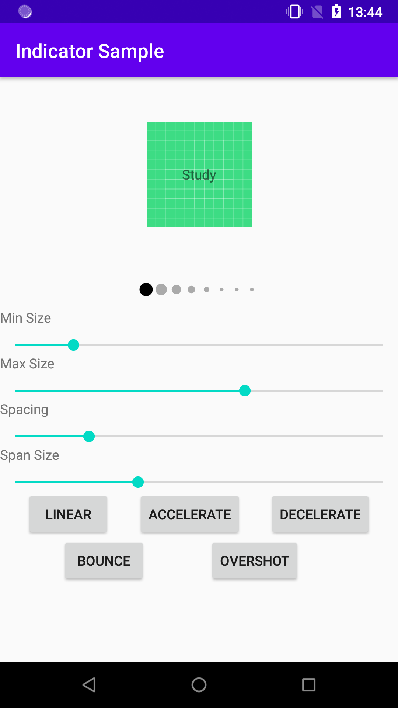

# GoodPagerIndicator

Custom implementation of view pager indicator. Current scroll value can be distributed between more "Dots", not just adjacent ones.

Currently only single visual is supported as well as only ViewPager2 as indicator's target.  Please check following sample to make sure, this is exactly what you need. New behaviors and features will be added later:

## Example usage  
Library is stored on JitPack, so you can include it in your project using this config:

Root [build.gradle](./build.gradle) 

    allprojects {
       repositories {
          ...
          maven { url 'https://jitpack.io' }
       }
    }

And in project [build.gradle](./app/build.gradle) use

    dependencies {
        implementation 'com.github.GoodRequest:GoodPagerIndicator:X.X.X'
    }

After successful sync, create your view using XML with `androidx.viewpager2.widget.ViewPager2` and one of the `GoodPagerIndicator` implementations. To see explanation of used attributes, please have a look at [Supported attributes section](#supported-attributes). To use `GoodPagerIndicator`, you can add this to your `layout.xml`

    <com.goodrequest.GoodPagerIndicator
      android:id="@+id/indicator"
      android:layout_width="match_parent"
      android:layout_height="wrap_content"
      app:indicator_click_enabled="true"
      app:indicator_dot_active_color="@android:color/black"
      app:indicator_dot_inactive_color="@android:color/darker_gray"
      app:indicator_dot_max_size="10dp"
      app:indicator_dot_min_size="0dp"
      app:indicator_dot_size_factor="1.3"
      app:indicator_dot_spacing="2dp"
      app:indicator_interpolator="linear"
      app:indicator_resizing_span="3"
      app:indicator_swipe_enabled="true"/>

In your activity, setup the `indicator` with given `view_pager` like this:

    indicator.initWith(view_pager)

Any changes to `view_pager` scroll position and its adapter will be reflected to the `indicator`. The pager indicator can also handle scrolling behavior, so you can easily

## Supported attributes
List of currently supported [attributes](./goodpagerindicator/src/main/res/values/attrs.xml):

### [GoodPagerIndicator](./goodpagerindicator/src/main/java/com/goodrequest/GoodPagerIndicator.kt)
1. **indicator_dot_min_size** : sets the minimal diameter of dot
2. **indicator_dot_max_size** : sets the maximal diameter of dot
3. **indicator_dot_spacing** : minimal spacing between 2 dots (dots however always takes max_size width)
4. **indicator_resizing_span** : set how many dots are affected by scrolling between pages
5. **indicator_dot_active_color** : color of dot on active position (accent color by default)
6. **indicator_dot_inactive_color** : color of dot on inactive position (primary color by default)
7. **indicator_interpolator** : interpolator to be used for computing dot diameter. Recommended values are `linear` and `accelerate`
8. **indicator_swipe_enabled** : enable / disable swipe gestures on indicator
9. **indicator_click_enabled** : enable / disable click gestures on indicator dots
10. **indicator_dot_size_factor** : multiplier for dot 'available space for drawing' (onMeasure)

### [ColorOnlyPagerIndicator](./goodpagerindicator/src/main/java/com/goodrequest/ColorOnlyPagerIndicator.kt)
1. **indicator_dot_active_color** : color of dot on active position (accent color by default)
2. **indicator_dot_inactive_color** : color of dot on inactive position (primary color by default)
3. **indicator_dot_size** : sets the diameter of dot
4. **indicator_dot_padding** : minimal spacing between 2 dots (dots however always takes max_size width)

### [PiePagerIndicator](./goodpagerindicator/src/main/java/com/goodrequest/PiePagerIndicator.kt)
1. **indicator_pie_color** : color of pie
2. **indicator_pie_size** : diameter of pie indicator
3. **indicator_pie_start_angle** : starting angle of pie drawing

### [PercentPagerIndicator](./goodpagerindicator/src/main/java/com/goodrequest/PercentPagerIndicator.kt)
No attributes available for now - text styling will be added

## Custom implementations
The mentioned pagers are based on well-defined base classes. Currently there are basically 3 different base classes recommended for your exploration, and those are
1. **[SameChildCountPagerIndicator](./goodpagerindicator/src/main/java/com/goodrequest/base/SameChildCountPagerIndicator.kt)** - This is indicator, that has exactly same amount of "dots" as the ViewPager has pages. The "dots" are not meant to be connected even during scrolling
2. **[SingleChildViewPagerIndicator](./goodpagerindicator/src/main/java/com/goodrequest/base/SingleChildViewPagerIndicator.kt)** - This indicator has exactly one "dot". The "dot" can be any View and it will receive scroll events, that should update it
3. **[SingleChildPagerIndicator](./goodpagerindicator/src/main/java/com/goodrequest/base/SingleChildPagerIndicator.kt)** - Implementation of SingleChildViewPagerIndicator that instantiates View with custom drawing

There is a plan to implement something like **SharedElementPagerIndicator**, that will allow to implement custom transition between "dots", like worm transition. This is however not yet implemented in this early stage of development. Guides on how to properly use mentioned classes will be stored on the [wiki page](https://github.com/GoodRequest/GoodPagerIndicator/wiki)